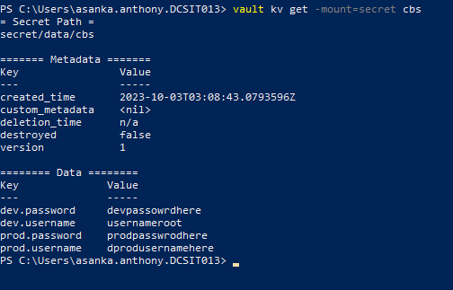

# Getting Started

### Reference Documentation

For further reference,

https://shanbhagsudharshan.medium.com/integrate-hashicorp-vault-with-spring-config-server-30993baa55b0

### Required vault with following credentials

vault kv put secret/cbs dev.username=dev-user dev.password=dev-password prod.username=prod-user prod.password=prod-password

`PS C:\Users\asanka.anthony.DCSIT013> vault kv get -mount=secret cbs`

